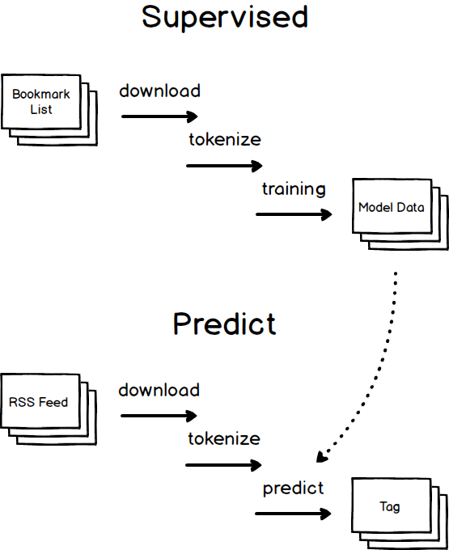

Webページのタグ分類システム
====

## 概要

ソーシャルブックマークのURL, Tagセットを学習して、  
RSSから取得した新しいWebページをタグ分類するシステムです。

## インストール方法

### 依存するプログラムのインストール

fasttext, mecab, glideをインストールします。

golangからmecabへアクセスするために、下記の環境変数を設定します。  
※「/usr/local/lib/」は実際のインストール場所に合わせて変更してください。

	$ export CGO_LDFLAGS="-L/usr/local/lib/ -lmecab -lstdc++"
	$ export CGO_CFLAGS="-I/usr/local/include"

### ビルド
ソースコードを展開して、下記のコマンドを実行します。

	$ bin/build.sh

## 実行方法

設定ファイル (go-tag-predict.toml)に、  
学習データと分類対象のRSSフィードの設定を記載してください。

	[supervised]
	learning_source_file - 学習データのファイルパス

	[predict]
	feed_urls - 分類対象のRSSフィード

学習データは、[Delicious](https://del.icio.us/)や、[Pinboard](https://pinboard.in/)のエクスポートデータをそのまま利用できます。

	学習データフォーマット
	<posts>
		<post href="https://..." description="title" tag="tag1 tag2 ..." />
		<post ... />
	</posts>

### 学習

	$ bin/tag-predict supervised

### 学習結果を元に、RSSフィードから取得したWebページを分類

	$ bin/tag-predict predict

## Dependencies
* [fasttext](https://github.com/facebookresearch/fastText) - Library for fast text representation and classification
* [mecab](http://taku910.github.io/mecab/) - 形態素解析エンジン
* [glide](https://github.com/Masterminds/glide) - Package Management for Golang
